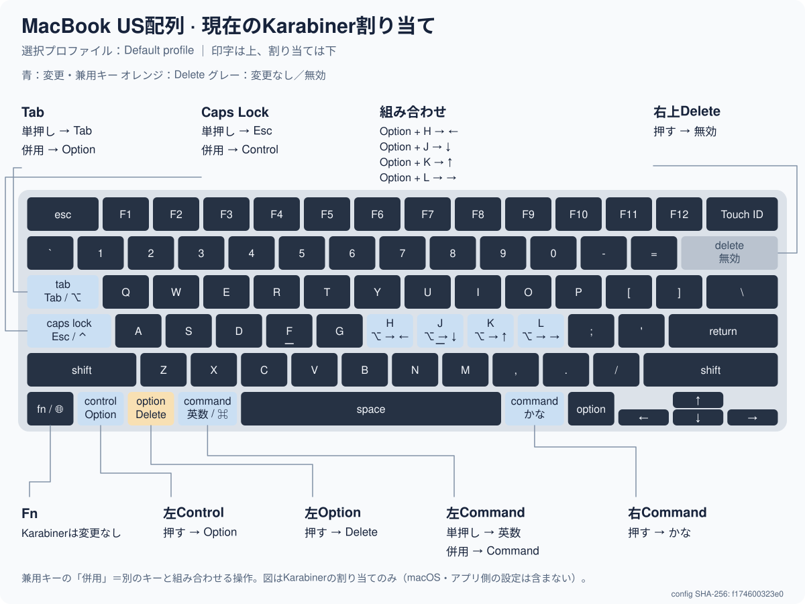

<!-- Generated by .config/dotfiles/scripts/karabiner_map.py. Do not edit. -->
# MacBook US配列の現在の割り当て



図をクリックすると拡大できます。キー位置はMacBook US配列の模式図です。

**正本：** [karabiner.json](karabiner.json)

**選択プロファイル：** Default profile

**設定のSHA-256：** `c1a811f6e6dc3aa87123b3732b9243ae3953fe89df9c841b9e5c7fd89c4999f2`

## 変更しているキー

| 物理キーの印字 | 現在の操作 |
| --- | --- |
| Delete（後方削除） | 押す → 無効 |
| Tab | 単押し → Tab ／ 併用 → 左Option |
| Caps Lock | 単押し → Esc ／ 併用 → 左Control |
| 左Option | 押す → Delete（後方削除） |
| 左Command | 単押し → 英数 ／ 併用 → 左Command |
| 右Command | 押す → かな |
| 右Option | 押す → Return |

「単押し」は短く押して離したときの動作です。「併用」は押しながら別のキーを使ったときの修飾キー動作です。単押しはキーを離した時点で送信され、長く押した場合の判定時間はKarabinerの設定に従います。

## 組み合わせ

| 入力 | 出力 | 併用できる追加の修飾キー |
| --- | --- | --- |
| Option + H | ← | Caps Lock |
| Option + J | ↓ | Caps Lock |
| Option + K | ↑ | Caps Lock |
| Option + L | → | Caps Lock |
| Option + N | Option + ←（単語←） | Caps Lock、Shift |
| Option + M | Option + →（単語→） | Caps Lock、Shift |

組み合わせの修飾キーは機能名です。物理キーの印字とは異なる場合があるため、上の表と合わせて確認してください。許可されていない追加の修飾キーを押した場合は、その組み合わせルールが適用されません。

図や表に変更がないキーは、Karabinerでは再割り当てしていません。Fn／地球儀キーの単押し、メディアキー、macOSやアプリのショートカットは、それぞれの設定に従います。

行頭・行末移動、単語移動、WezTermのLEADERは [Vim以外の文字編集](../dotfiles/README.md#vim以外の文字編集) を参照してください。Shiftを加えた選択操作は一般的な文章入力欄向けです。ターミナルの選択・編集はシェルやTUIアプリのキーバインドに従います。

## 更新方法（人・AIエージェント共通）

1. `karabiner.json` を編集します。
2. リポジトリのルート（yadmの場合はHOME）で再生成します。

   ```bash
   python3 .config/dotfiles/scripts/karabiner_map.py
   python3 .config/dotfiles/scripts/karabiner_map.py --check
   ```

3. SVGを開き、文字や注釈の重なりと割り当てを確認します。
4. JSON・このREADME・SVGを同じコミットに含めます。

READMEとSVGは生成物ですが、GitHubで表示するためGit管理します。図や表だけを手編集せず、割り当てはJSON、図の配置や説明の形式は [生成スクリプト](../dotfiles/scripts/karabiner_map.py) を修正してください。

既存の `dotfiles check`、pre-commit/pre-push、GitHub Actionsは再生成漏れを検知します。ステージ済みファイルとpush対象のコミットも検証します。

条件分岐・デバイス別設定・未対応のイベントを追加した場合、生成はエラーで停止します。スクリプトとテストを拡張して、図が実際より単純な動作を示さないようにしてください。

配列の参考：[Apple — MacBook AirのMagic Keyboard](https://support.apple.com/guide/macbook-air/magic-keyboard-apdab672d5e9/mac)。図は独自のSVGで、Appleの製品画像はリポジトリに含めていません。
